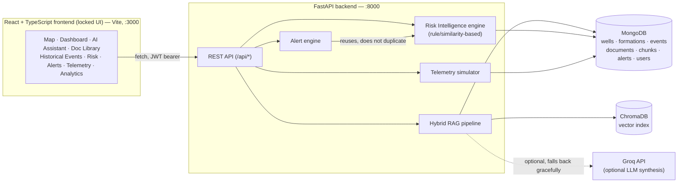

# eRTMAC-NWIS — Nearby Wells Intelligence System

AI-assisted decision-support prototype for drilling operations, built for **Smart India Hackathon 2026** (Problem Statement ID **26121**, Organization: **Oil India Limited**).

eRTMAC-NWIS gives a drilling team a single place to explore nearby wells, historical drilling events, subsurface formations, and reference documents, ask natural-language questions grounded in indexed source documents, and see a transparent, explainable risk assessment for a proposed depth/mud-weight combination — all backed by a real FastAPI + MongoDB + hybrid-RAG service, not client-side mocks.

**The frontend UI is intentionally locked** for this project: no redesign, no new screens, no removed components. All backend work in this repository exists to make the *existing* UI run on real data, real retrieval, and a real (if intentionally lightweight) risk engine instead of hardcoded fixtures.

> **This is a hackathon prototype, not an OIL India production system.** It has no connection to OIL's live eRTMAC telemetry network or proprietary well database. See [Demo Status & Limitations](#demo-status--limitations) before drawing conclusions from anything it outputs.

---

## Table of Contents

- [Hackathon Context](#hackathon-context)
- [Architecture](#architecture)
- [Data Provenance](#data-provenance)
- [Features](#features)
- [RAG Pipeline](#rag-pipeline)
- [Risk Intelligence](#risk-intelligence)
- [Alert Engine](#alert-engine)
- [Telemetry](#telemetry)
- [Analytics](#analytics)
- [API Reference](#api-reference)
- [Tech Stack](#tech-stack)
- [Project Structure](#project-structure)
- [Local Setup](#local-setup)
- [Environment Variables](#environment-variables)
- [Testing](#testing)
- [Demo Status & Limitations](#demo-status--limitations)
- [Security & Data Handling](#security--data-handling)
- [Deployment](#deployment)
- [Roadmap](#roadmap)

---

## Hackathon Context

| | |
|---|---|
| Event | Smart India Hackathon 2026 |
| Problem Statement ID | 26121 |
| Organization | Oil India Limited (OIL) |
| Problem | eRTMAC-NWIS — Nearby Wells Intelligence System |

The brief this prototype responds to: give drilling engineers fast, evidence-grounded access to what's known about nearby wells — historical incidents, formation hazards, reference documents — instead of manually cross-referencing paper reports. This repository does **not** have access to OIL's actual eRTMAC real-time telemetry network or internal well database; everything it demonstrates uses either the small set of genuinely public documents provided with the project, or clearly labeled synthetic demonstration data standing in for what a production integration would draw on.

## Architecture



The frontend talks to the FastAPI backend directly over HTTP (`http://localhost:8000`, CORS-enabled) via a small set of typed `src/services/*Api.ts` clients — every chart, table, and panel in the locked UI renders whatever the backend actually returns.

One architectural note worth flagging: this repository still contains `server.ts`, a small Express/Vite dev server left over from the project's original Google AI Studio scaffold, along with its own `@google/genai` (Gemini) client and mock `/api/rag/chat` / `/api/telemetry/current` routes. **These are not part of the live data path.** Every frontend service in `src/services/` calls the FastAPI backend on port 8000, not the Express server's mock routes — `server.ts` today only serves the Vite dev build. See [Repository Inconsistencies](#repository-inconsistencies-noted-not-fixed) below.

## Data Provenance

Every record the backend serves carries a `source` (free text) and `sourceType` (enum) field so real and demonstration data are never visually or programmatically indistinguishable. Full detail: [`docs/DATA_SOURCES.md`](docs/DATA_SOURCES.md).

| `sourceType` | What it actually is | Where it lives |
|---|---|---|
| `public_document` | **5 real PDF files** provided with the project (`data/raw/oil_india/`) — facility-level environmental/regulatory filings (e.g. Environmental Clearance documentation, well plugging/site-abandonment procedures, Gazette references). Confirmed **not** to be WCR/DDR-style well completion reports: no individual well coordinates, drilling depths, formation tops, or incident logs were found in the one PDF fully extracted so far (`4_Ningru_0.pdf`, 79 chunks). | `data/raw/oil_india/*.pdf`, registered in MongoDB `documents`, text-indexed on demand via `POST /api/documents/index` |
| `government_data` | **1 real CSV**, a national table of flowing-oil-well counts by operator/state (23 rows, no individual well identities or coordinates) | `data/raw/government/PNG_Statistics_2020-21_Table2.3_0.csv` |
| `geospatial_data` | **1 real OpenStreetMap extract** for Assam — the base map layer (roads, settlements, boundaries). Contains no well point data. | `data/raw/geospatial/assam.pbf` |
| `synthetic_demo` | Every well, formation, historical incident, alert, and telemetry reading the UI renders — originating from the frontend's own `src/data/wellsData.ts` / `src/data/historicalRiskTrends.ts` fixtures (from the project's original AI Studio scaffold), seeded verbatim into MongoDB and indexed into the RAG corpus so the AI Assistant can still answer the kind of nearby-well questions the locked UI's demo scenarios ask. **Never presented as a real OIL India operational record anywhere in this codebase.** | Exported via `scripts/export_frontend_fixtures.ts` → `backend/app/db/seed_data/frontend_fixtures.json` → seeded by `app/db/seed.py` |
| `derived` | Anything computed or uploaded after the fact — a document a user uploads via `POST /api/documents/upload`, pending re-tagging | Runtime-created |

**In numbers (as seeded):** 18 wells, 8 formations, 12 historical events, 4 demo user accounts — all `synthetic_demo`. 5 real PDFs + 1 real CSV + 1 real `.pbf` extract are the entire real-data footprint of this prototype.

Risk scores, alerts, and telemetry readings computed from `synthetic_demo` inputs are themselves demonstration outputs — every one of them carries `isSimulation` / `sourceTypes` fields so a caller can tell exactly what did and didn't contribute real evidence. None of it should be read as an actual OIL India operational assessment.

## Features

The locked frontend's tabs, now backed end-to-end by the FastAPI service:

1. **Authentication** — JWT login/register against real MongoDB user accounts (bcrypt-hashed passwords), plus the UI's original preset "quick switch" demo profiles.
2. **Wells / GIS Map** — 18 seeded wells rendered on the Leaflet map from `GET /api/wells`, with real haversine-distance nearby-well queries.
3. **Historical Events** — filterable table of demonstration drilling incidents (`GET /api/events`), each traceable to a synthetic pseudo-document indexed for RAG.
4. **Document Library** — lists real (`public_document`) and demonstration (`synthetic_demo`) documents, supports upload and on-demand indexing.
5. **AI Assistant (RAG chat)** — hybrid BM25 + vector retrieval over the indexed corpus, optionally synthesized by Groq, always evidence-cited.
6. **Risk Intelligence** — transparent, explainable per-depth/mud-weight risk scoring (see below).
7. **Alerts** — evidence-backed alerts generated from the same Risk Intelligence engine, not a separate model.
8. **Telemetry** — deterministic per-well simulated drilling telemetry stream.
9. **Analytics** — server-aggregated statistics across events, alerts, documents, and formations, filterable by selected well.

## RAG Pipeline

Implemented in `backend/app/ingestion/` and `backend/app/rag/`:

1. **Extraction** (`ingestion/extract.py`) — PyMuPDF (`fitz`) per-page text extraction; pages with suspiciously little extracted text fall back to Tesseract OCR (`pytesseract`) best-effort, never failing the whole ingest if OCR is unavailable.
2. **Chunking** (`ingestion/extract.py`) — sliding-window chunking (900 chars, 150 overlap), page number preserved on every chunk.
3. **Deterministic chunk IDs** (`ingestion/pipeline.py`) — `{documentId}::p{page}::{index}`, so re-indexing a document overwrites its old chunks/embeddings instead of duplicating them.
4. **Storage** — chunks persisted in MongoDB (`document_chunks`) as the single source of truth; embedded into a **ChromaDB** persistent collection (`rag/embeddings.py`, `sentence-transformers/all-MiniLM-L6-v2` by default).
5. **Hybrid retrieval** (`rag/retrieval.py`) — BM25 (`rank_bm25`) lexical search and Chroma vector search run independently, scores normalized and merged (0.5/0.5), then optionally **reranked with a cross-encoder** (`cross-encoder/ms-marco-MiniLM-L-6-v2`). If Chroma/sentence-transformers aren't available in the environment, the pipeline degrades gracefully to BM25-only rather than crashing.
6. **Confidence gating** (`rag/synthesize.py`) — a confidence score is derived from the top merged/reranked score; below `CONFIDENCE_FLOOR_FOR_SUFFICIENT_EVIDENCE` (0.30), the endpoint returns `isInsufficientInfo: true` with **no synthesized answer**, rather than guessing.
7. **Generation** — if `GROQ_API_KEY` is set, the top evidence is handed to Groq (OpenAI-compatible API) with a system prompt that forbids inventing names, depths, or figures not present in the evidence. If no key is configured or the call fails, a deterministic (non-LLM) fallback synthesizes directly from the top-ranked excerpt — never fabricated content.
8. **Citations** — every response carries `citations[]`, each with `documentId`, `page`, `excerpt`, and `sourceType`, so the frontend can (and does) show exactly which kind of evidence backed the answer.

The LLM provider is abstracted behind `app/services/llm_provider.py` so swapping providers later doesn't touch any retrieval code.

## Risk Intelligence

`backend/app/services/risk_engine.py` — **a rule/similarity-based heuristic engine, not a trained machine-learning model.** There is not enough labelled incident data behind this prototype to train or validate one, and the code says so directly. Every number in a risk response traces to an actual input, formation record, matched historical event, live telemetry reading, or retrieved document excerpt.

Signals it actually uses:
- **Geomechanical margin** — how far the requested mud weight sits outside the formation's pore-pressure/fracture-gradient safe window.
- **Formation hazard multiplier** — from the seeded formations collection (`hazardSeverity`: none → critical).
- **Historical event similarity** — depth proximity, formation-name match, and nearby-well context against the 12 seeded demonstration events.
- **Nearby-well context** — real haversine distance over stored coordinates, not a fabricated proximity list.
- **Live telemetry flow signal** — a flow-out/flow-in delta beyond a configured threshold nudges Mud Loss / Gas Kick probability, only when telemetry for that well actually exists.
- **Document evidence** — reuses the same hybrid RAG retrieval pipeline (not a second search implementation) for the single highest-probability risk type.

All thresholds live in one place, `DEMO_HEURISTIC_THRESHOLDS`, explicitly documented in-code as **engineering heuristics chosen to make the demo legible — not sourced from any OIL India operating standard.** Every response includes `isSimulation` (true whenever a live-telemetry-derived signal contributed) and `sourceTypes` (the provenance categories actually represented), so a demo result can never be mistaken for a real operational warning.

## Alert Engine

`backend/app/services/alert_engine.py` — generates alerts **from the Risk Intelligence engine above, not a second/independent model.** There is one source of truth for risk calculations in this codebase.

- Evaluates each eligible well (`status` in `Drilling`/`Active`) against `risk_engine.predict_risk()`.
- Only `CRITICAL`/`HIGH` severities with actual supporting evidence become alerts — an evidence-less alert is never created.
- **Deterministic alert identity**: id = `f"{wellId}:{riskTypeKey}"`, so re-evaluation upserts the same document instead of duplicating; a user's acknowledge/resolve state is preserved across re-evaluation.
- Alerts whose underlying condition no longer holds are removed on the next pass — **except** ones a user has resolved, which persist.
- Every alert carries the same `evidence`, `signals`, `sourceTypes`, and `isSimulation` fields the risk engine produced — nothing is re-derived or re-labelled in transit.

## Telemetry

`backend/app/telemetry/simulator.py` — **explicitly simulated, demo-only telemetry.** Every reading carries `isSimulation: true`, `mode: "DEMO_SIMULATION"`, and `sourceType: "synthetic_demo"`. There is no live OIL India eRTMAC feed available to this project; a `mode: "REAL_DATA"` contract value is a defined-but-intentionally-unimplemented stub, never filled with fabricated numbers.

State is tracked **per well ID** (not a single shared counter), so selecting different wells never mixes their simulated depth progression. Fields produced: `depthM`, `ropMhr` (rate of penetration), `wobTons` (weight on bit), `rpm`, `torqueKNm`, `sppPsi` (standpipe pressure), `mudFlowInLpm`/`mudFlowOutLpm`, `pitVolumeM3`, `gasUnits`, `mudWeightInSG`/`mudWeightOutSG`, `activeFormation`, `hazardStatus`.

## Analytics

`backend/app/api/analytics.py` — server-side aggregation only; **never re-runs risk or RAG calculations per chart.** Two endpoints back the locked `StratigraphicAnalyticsView` component:

- `GET /api/analytics/overview?wellId=` — well/event/alert/document counts and distributions (by type, severity, source type, formation, depth bucket), all computed directly from stored MongoDB documents. Empty categories are omitted, never invented to fill a chart.
- `GET /api/analytics/formations?wellId=` — per-formation incident/NPT aggregation (reusing the risk engine's own formation-name matching logic, unmodified) plus a real nearest-neighbor well comparison (same haversine logic as `/api/wells/nearby`).

Alert statistics are read directly from the Alert Engine's current state (`isSimulation`, `sourceTypes` included as-is) rather than recomputed — one source of truth, reused.

## API Reference

Base path: `/api`. Full request/response shapes: [`docs/BACKEND_API_CONTRACT.md`](docs/BACKEND_API_CONTRACT.md).

**Authentication**
| Method | Path | Purpose |
|---|---|---|
| POST | `/auth/login` | Email/password login, returns JWT + user profile |
| POST | `/auth/register` | Self-registration (never grants ADMIN) |
| GET | `/auth/me` | Current user profile from bearer token |
| POST | `/auth/logout` | Client-side token discard (stateless JWT, no server session) |

**Wells**
| Method | Path | Purpose |
|---|---|---|
| GET | `/wells` | List wells, filterable by status/field/formation |
| GET | `/wells/nearby` | Wells within a radius of a lat/lng (real haversine) |
| GET | `/wells/{well_id}` | Single well |
| GET | `/wells/{well_id}/events` | Events for one well |
| GET | `/wells/{well_id}/formations` | Formations intersected by one well |

**Formations**
| Method | Path | Purpose |
|---|---|---|
| GET | `/formations` | All seeded stratigraphic formations |

**Events**
| Method | Path | Purpose |
|---|---|---|
| GET | `/events` | Historical incidents, filterable by well/type/severity/formation |
| POST | `/events` | Create a demonstration event (Document Library "Add" flow) |
| DELETE | `/events/{event_id}` | Delete an event and its indexed chunk/document |

**Documents**
| Method | Path | Purpose |
|---|---|---|
| GET | `/documents` | List documents, filterable by source type / name |
| GET | `/documents/{document_id}` | Single document |
| POST | `/documents/upload` | Upload a file (ADMIN/SUPERVISOR only) |
| DELETE | `/documents/{document_id}` | Delete a document and its chunks (ADMIN/SUPERVISOR only) |
| POST | `/documents/index` | Extract, chunk, and embed a registered document (ADMIN/SUPERVISOR only) |

**Search / RAG**
| Method | Path | Purpose |
|---|---|---|
| POST | `/search` | Raw hybrid retrieval, no synthesis |
| POST | `/rag/chat` | Full RAG pipeline: retrieval + confidence gating + synthesis + citations |

**Risk**
| Method | Path | Purpose |
|---|---|---|
| POST | `/risk/predict` | Full risk assessment for a depth/mud-weight/formation/well combination |
| GET | `/risk/history` | Stored-event-derived correlation summary |

**Alerts**
| Method | Path | Purpose |
|---|---|---|
| GET | `/alerts` | Re-evaluates and lists current alerts, filterable by well/acknowledged |
| POST | `/alerts/{alert_id}/acknowledge` | Acknowledge an alert |
| POST | `/alerts/{alert_id}/resolve` | Resolve an alert (persists across re-evaluation) |

**Telemetry**
| Method | Path | Purpose |
|---|---|---|
| GET | `/telemetry/current` | Next simulated reading for a well |
| GET | `/telemetry/history` | Stored reading history for a well |

**Analytics**
| Method | Path | Purpose |
|---|---|---|
| GET | `/analytics/overview` | Well/event/alert/document aggregates, optional well filter |
| GET | `/analytics/formations` | Formation-level aggregates + nearest-neighbor well comparison |
| GET | `/analytics/correlation` | Total incident/NPT summary |

**Health**
| Method | Path | Purpose |
|---|---|---|
| GET | `/health` | Service status, indexed well/report counts, LLM provider status |

## Tech Stack

**Frontend** — React 19, TypeScript, Vite, Tailwind CSS, Leaflet (`react-leaflet` via `leaflet`), Recharts, Lucide icons, Express (dev server / build host only).

**Backend** — Python 3.11, FastAPI, Uvicorn, Pydantic v2 / pydantic-settings, Motor (async MongoDB driver), python-jose (JWT), bcrypt.

**Data layer** — MongoDB, ChromaDB (persistent vector store), sentence-transformers (embeddings), rank-bm25 (lexical retrieval), a cross-encoder reranker (`sentence-transformers`).

**AI / LLM** — Groq (OpenAI-compatible Chat Completions API, `openai` SDK), used only for optional answer synthesis on top of retrieved evidence; abstracted behind a provider interface.

**Document processing** — PyMuPDF (`fitz`), pdfplumber, pytesseract (OCR fallback), Pillow.

**Testing** — pytest, pytest-asyncio, TypeScript's own `tsc --noEmit`.

## Project Structure

```
eRTMAC-NWIS/
├── src/                        # Locked React frontend
│   ├── components/             # All UI views/panels (map, RAG chat, analytics, etc.)
│   ├── services/                # Typed fetch clients — the ONLY thing that changed to
│   │                            #   connect the locked UI to the real backend
│   ├── data/                    # Original AI-Studio-scaffolded demo fixtures (synthetic_demo)
│   └── types/
├── server.ts                    # Vite dev/build host (Express) — legacy mock routes unused
├── backend/                      # FastAPI service
│   ├── app/
│   │   ├── api/                  # One router module per resource (wells, rag, risk, ...)
│   │   ├── services/              # risk_engine.py, alert_engine.py, llm_provider.py
│   │   ├── rag/                   # retrieval.py, embeddings.py, synthesize.py
│   │   ├── ingestion/              # extract.py, pipeline.py
│   │   ├── telemetry/              # simulator.py
│   │   ├── geospatial/              # distance.py (haversine)
│   │   ├── db/                       # mongodb.py, seed.py, repositories/
│   │   └── schemas/                   # Pydantic models mirroring the frontend's TS types
│   ├── tests/                    # pytest suite (11 files, 64 tests)
│   └── requirements.txt
├── data/
│   ├── raw/oil_india/             # 5 real public PDFs
│   ├── raw/government/            # 1 real CSV
│   └── raw/geospatial/            # 1 real OSM .pbf extract
├── docs/                          # DATA_SOURCES.md, BACKEND_API_CONTRACT.md, integration analyses
├── scripts/export_frontend_fixtures.ts
├── docker-compose.yml             # mongo + backend, for local/demo use
└── README.md
```

## Local Setup

**Prerequisites:** Node.js (repo built/tested with v24), Python 3.11, a running MongoDB instance (local native install or `docker compose up -d mongo`), a Groq API key (optional).

```bash
# 1. Frontend dependencies (also used to export fixtures for backend seeding)
npm install

# 2. Backend dependencies
cd backend
python -m venv .venv
./.venv/Scripts/python.exe -m pip install -r requirements.txt   # Windows
# source .venv/bin/activate && pip install -r requirements.txt  # macOS/Linux

# 3. Configure the backend
cp .env.example .env
# Edit .env — MONGODB_URI must point at a reachable MongoDB.
# GROQ_API_KEY is optional: without it, /api/rag/chat still performs real
# hybrid retrieval and answers with a deterministic (non-LLM) synthesis.

# 4. Export the frontend's demo fixtures, then seed MongoDB
cd ..
npx tsx scripts/export_frontend_fixtures.ts
cd backend
./.venv/Scripts/python.exe -m app.db.seed

# 5. Run the backend
./.venv/Scripts/python.exe -m uvicorn app.main:app --reload --port 8000

# 6. In a second terminal, run the frontend
cd ..
npm run dev   # serves the locked UI on http://localhost:3000
```

Health check: `curl http://localhost:8000/api/health`

**Indexing the real PDFs for RAG retrieval** (optional — the pipeline works without this, just without real-document evidence):

```bash
curl -X POST http://localhost:8000/api/documents/index \
  -H "Content-Type: application/json" \
  -d '{"documentId": "<id from GET /api/documents>"}'
```

This requires an ADMIN/SUPERVISOR bearer token in a real deployment; the seeded demo accounts include one.

**Demo login:** every seeded account shares the dev-only password `ChangeMe123!` (e.g. `rudrachauhan12805@gmail.com`). This is intentionally documented for local demo use, not a leaked secret — rotate before any non-local deployment.

## Environment Variables

Backend (`backend/.env`, see `backend/.env.example`):

| Variable | Required | Default | Notes |
|---|---|---|---|
| `MONGODB_URI` | Yes | `mongodb://localhost:27017` | |
| `MONGODB_DB_NAME` | Yes | `ertmac_nwis` | |
| `JWT_SECRET` | Yes for non-local use | `dev-secret-change-me` | Change before any shared/deployed use |
| `JWT_ALGORITHM` | No | `HS256` | |
| `JWT_EXPIRE_MINUTES` | No | `720` | |
| `CORS_ORIGINS` | Yes | `http://localhost:3000,...` | Comma-separated |
| `CHROMA_PATH` | No | `./chroma_data` | Vector store location |
| `DOCUMENT_STORAGE_PATH` | No | `./document_storage` | Uploaded file storage |
| `RAW_DATA_PATH` | No | `../data/raw` | Where the real PDFs/CSV/pbf live |
| `GROQ_API_KEY` | Optional | *(empty)* | Without it, RAG synthesis falls back to deterministic evidence formatting |
| `GROQ_BASE_URL` | Optional | `https://api.groq.com/openai/v1` | |
| `GROQ_MODEL` | Optional | `openai/gpt-oss-120b` | |
| `EMBEDDING_MODEL` | Optional | `sentence-transformers/all-MiniLM-L6-v2` | |
| `RERANKER_MODEL` | Optional | `cross-encoder/ms-marco-MiniLM-L-6-v2` | |

Never commit a populated `backend/.env` — it's gitignored. No secrets are checked into this repository.

## Testing

Backend: **64 tests across 11 files** (`backend/tests/`) — `pytest` + `pytest-asyncio` against a real MongoDB instance. Coverage includes: authentication (login/register/token validation), wells and nearby-well geospatial queries, event CRUD and RAG chunk lifecycle, document upload/index/delete, hybrid RAG retrieval and insufficient-evidence gating, risk engine signal correctness, alert generation/deduplication/resolve-persistence, telemetry per-well state isolation, and analytics aggregation correctness/provenance.

```bash
cd backend
./.venv/Scripts/python.exe -m pytest
```

Frontend: `npm run lint` runs `tsc --noEmit` (no dedicated frontend unit-test suite exists in this repository). UI correctness for each integrated module was additionally verified through manual and Playwright-driven browser sessions during development (see `docs/*_INTEGRATION_ANALYSIS.md` for the record of what was checked per module).

## Demo Status & Limitations

This is a **hackathon prototype and decision-support demonstration**, not a production OIL India system. Specifically:

- The 18 wells, 8 formations, and 12 historical events rendered throughout the UI are **synthetic demonstration fixtures**, not real OIL India well records.
- Telemetry is **deterministically simulated**, not a live eRTMAC feed — there is no live feed available to this project.
- The 5 real OIL India PDFs are **facility-level environmental/regulatory documents**, not a complete proprietary drilling-incident database — they do not contain per-well drilling histories.
- Risk Intelligence is a **rule/similarity-based heuristic engine**, explicitly not a trained/validated ML model, and its thresholds are engineering choices for demo legibility, **not OIL India operating standards**.
- Alerts generated by this system are **demonstration outputs** and must not be treated as official operational alarms.
- Outputs from `/api/rag/chat`, `/api/risk/predict`, and alerts should be treated as illustrative of the intended workflow, **not as real drilling instructions**.

## Security & Data Handling

- **Authentication**: JWT bearer tokens (`python-jose`, HS256), passwords hashed with `bcrypt` — no plaintext password storage.
- **Authorization**: role-gated endpoints (`ADMIN`/`SUPERVISOR`) for document upload, delete, and indexing, enforced via a FastAPI dependency (`app/dependencies.py::require_roles`).
- **Secrets**: supplied only through environment variables (`.env`, gitignored); no API keys or credentials are committed in this repository.
- **Session model**: stateless JWT — logout is a client-side token discard; there is no server-side token denylist/session store in this prototype (documented limitation, not silently omitted).
- No claim of enterprise-grade security certification is made or implied.

### Repository Inconsistencies (noted, not fixed)

Found during this audit, left as-is because fixing them was outside this README task's scope:

- The root `Dockerfile` is a placeholder Docker-Desktop-generated scaffold (`alpine` + `fortune`) unrelated to this project — the real backend container definition is `backend/Dockerfile`, orchestrated together with MongoDB via `docker-compose.yml`.
- `server.ts` (the frontend's Express/Vite dev host) still contains a leftover `@google/genai` (Gemini) client and mock `/api/rag/chat` / `/api/telemetry/current` routes from the project's original AI Studio scaffold. These are **not called** by the current frontend — every `src/services/*Api.ts` client talks to the FastAPI backend on port 8000 instead. The root `.env.example` (`GEMINI_API_KEY`, `APP_URL`) reflects this same legacy scaffold, not the current Groq-based backend.
- `docker-compose.yml`'s `GROQ_MODEL` default (`llama-3.3-70b-versatile`) is a deprecated model id; the backend's own `.env.example` and `config.py` default to the current `openai/gpt-oss-120b`.

## Deployment

Only **local development** is currently configured and verified: `npm run dev` (frontend, port 3000) + `uvicorn` (backend, port 8000) + MongoDB (native service or `docker compose up -d mongo`).

`docker-compose.yml` at the repo root defines a `mongo` + `backend` stack (`docker compose up -d`) suitable for a self-contained demo environment where Docker is available. There is no CI/CD pipeline, cloud hosting configuration, or production deployment target defined in this repository — treat any deployment beyond local/demo as unimplemented.

## Roadmap

Items explicitly out of scope for this prototype but relevant if extended toward a real integration:

- A genuine `mode: "REAL_DATA"` telemetry path once a live eRTMAC feed is actually available (the contract field already exists, intentionally unimplemented).
- Text extraction/indexing of the remaining 4 real PDFs beyond the one already verified (`4_Ningru_0.pdf`).
- A background scheduler for alert re-evaluation, instead of re-evaluating on each `GET /api/alerts` call.
- Server-side token revocation/denylist for logout.
